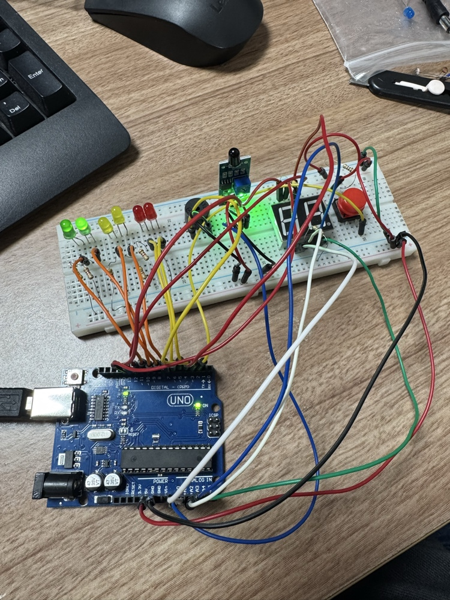
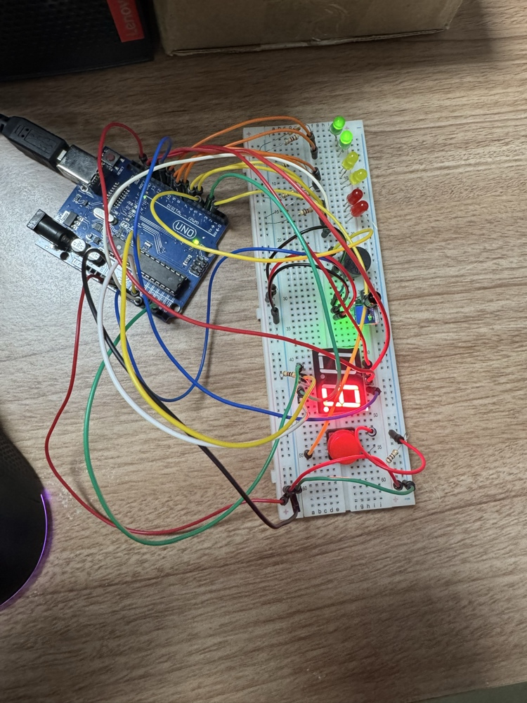
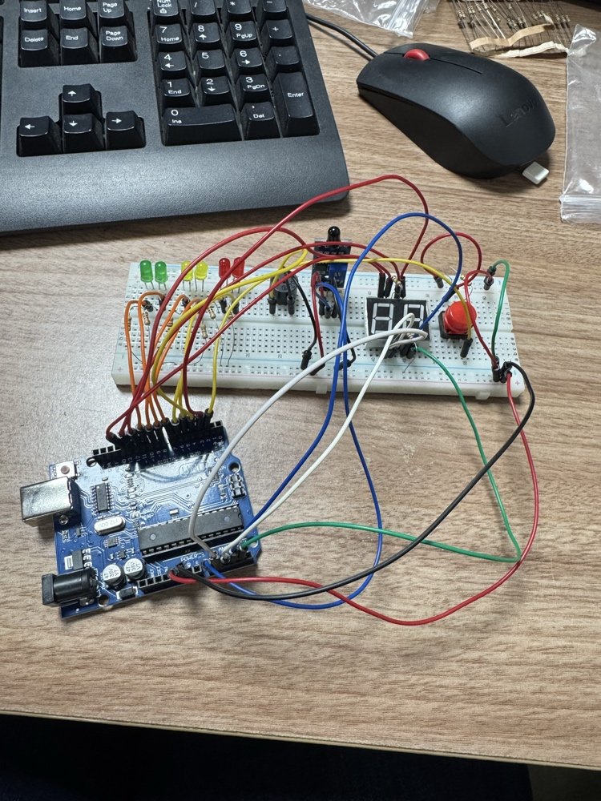

# Projeto IoT: Alarme de Incendio com Sensor de Chama e Display

Projeto academico da disciplina de **Internet das Coisas (IoT)** que implementa um sistema de **alarme de incendio** utilizando Arduino UNO, sensor de chama, LEDs indicadores, buzzer e display de 7 segmentos.

O sistema monitora continuamente o ambiente e sinaliza tres niveis de alerta (seguro, atencao e perigo critico) com feedback visual e sonoro em tempo real.

<p align="center">
  
  
  
</p>

---

## Equipe

| Nome |
|------|
| Richardson da Conceicao Ferreira |
| Wallace Gustavo da Silva |
| Emanuele De Oliveira Ferreira |
| Vinicius Silva Da Conceicao |

---

## Componentes Utilizados

| Componente | Quantidade | Conexao |
|---|---|---|
| Arduino UNO | 1 | - |
| Sensor de Chama (IR) | 1 | A0 |
| Botao (push-button) | 1 | D2 (INPUT_PULLUP) |
| Buzzer | 1 | D4 |
| LED Verde | 2 | D9, D10 |
| LED Amarelo | 2 | D7, D8 |
| LED Vermelho | 2 | D5, D6 |
| Display 7 Segmentos (Anodo Comum) | 1 | Ver tabela abaixo |
| Resistores (220 Ohm para LEDs) | 6 | Em serie com cada LED |

### Pinagem do Display de 7 Segmentos

| Segmento | Pino Arduino |
|---|---|
| A | 13 |
| B | 3 |
| C | A4 |
| D | A2 |
| E | A1 |
| F | 12 |
| G | 11 |
| DP (ponto) | A3 |

---

## Como Funciona

O sensor de chama le continuamente a intensidade de luz infravermelha. O valor analogico (0-1023) determina o estado do sistema:

```
Leitura > 700  -->  SEGURO   (LEDs verdes acesos)
300 < Leitura <= 700  -->  ALERTA   (LEDs amarelos acesos)
Leitura <= 300  -->  PERIGO   (LEDs vermelhos + buzzer 2500 Hz)
```

### Diagrama de Estados

```
                  leitura > 700+H
            ┌──────────────────────┐
            v                      │
       ┌─────────┐          ┌───────────┐
       │ SEGURO  │──────────│  ALERTA   │
       │ (verde) │ <= 700-H │ (amarelo) │
       └─────────┘          └───────────┘
            ^                    │
            │  > 700+H           │ <= 300-H
            │                    v
            │              ┌───────────┐
            └──────────────│  PERIGO   │
               > 700+H    │(vermelho) │
                           └───────────┘
                                │
                          botao pressionado
                                v
                         ┌──────────────┐
                         │ SILENCIADO   │
                         │ (contagem    │
                         │  regressiva) │
                         └──────────────┘
                                │
                          10 segundos
                                v
                           volta para
                            SEGURO

H = histerese (30 unidades) para evitar oscilacao
```

### Silenciamento

Ao pressionar o botao fisico:
1. O alarme e silenciado imediatamente
2. O display de 7 segmentos inicia uma contagem regressiva de 9 ate 0
3. A cada segundo, o buzzer emite um bipe rapido (50 ms a 2000 Hz)
4. Apos 10 segundos, o monitoramento e retomado automaticamente

---

## Como Usar

### Requisitos

- [Arduino IDE](https://www.arduino.cc/en/software) (1.8+) **ou** [PlatformIO](https://platformio.org/)
- Placa Arduino UNO (ou compativel)
- Cabo USB tipo B

### Upload via Arduino IDE

1. Abra o arquivo `codigo.ino` na Arduino IDE
2. Selecione a placa: **Ferramentas > Placa > Arduino UNO**
3. Selecione a porta serial correta: **Ferramentas > Porta**
4. Clique em **Upload** (seta para a direita)
5. Abra o **Monitor Serial** (9600 baud) para acompanhar as leituras

### Upload via PlatformIO

```bash
# Instalar PlatformIO CLI (se necessario)
pip install platformio

# Compilar e fazer upload
pio run --target upload

# Monitorar saida serial
pio device monitor --baud 9600
```

### Calibracao

Os limiares de deteccao podem variar conforme a iluminacao do ambiente. Para calibrar:

1. Abra o Monitor Serial (9600 baud)
2. Observe os valores exibidos com o sensor em repouso (sem chama)
3. Aproxime uma chama e observe o valor diminuir
4. Ajuste as constantes `LIMIAR_SEGURO` e `LIMIAR_ALERTA` no inicio do codigo conforme necessario

---

## Estrutura do Repositorio

```
Projeto_IoT/
├── codigo.ino                # Codigo-fonte do Arduino
├── platformio.ini            # Configuracao PlatformIO
├── README.md
├── LICENSE
├── .gitignore
├── docs/
│   ├── requisitos-nao-funcionais.md   # Requisitos nao funcionais (ISO 25010)
│   └── imagens/
│       ├── montagem-circuito-01.jpg
│       ├── montagem-circuito-02.jpg
│       └── montagem-circuito-03.jpg
└── frontend/
    ├── index.html            # Dashboard web de monitoramento
    ├── style.css             # Estilos do dashboard
    └── app.js                # Logica de simulacao (espelho do codigo.ino)
```

---

## Dashboard Web (Frontend)

O projeto inclui um dashboard web interativo que simula o comportamento do sistema de alarme em tempo real. Para abrir:

```bash
# Basta abrir o arquivo no navegador
open frontend/index.html
# ou
xdg-open frontend/index.html
```

### Funcionalidades do Dashboard

- **Painel de status** com badge colorido (SEGURO / ALERTA / PERIGO / SILENCIADO)
- **LEDs virtuais** que replicam os LEDs fisicos do circuito
- **Gauge (velocimetro)** com leitura do sensor em tempo real
- **Grafico de historico** com as ultimas 200 leituras e faixas de limiares
- **Display de 7 segmentos** que simula a contagem regressiva durante o silenciamento
- **Diagrama de estados** interativo que destaca o estado atual
- **Controles de simulacao**: slider para ajustar o nivel do sensor, botoes de preset e modo automatico
- **Monitor serial** que replica a saida do `Serial.print()` do Arduino
- **Audio simulado**: buzzer virtual com Web Audio API

> O frontend nao requer instalacao de dependencias — funciona 100% no navegador com HTML5, CSS3 e JavaScript vanilla.

---

## Requisitos Nao Funcionais

A documentacao completa de requisitos nao funcionais esta em [`docs/requisitos-nao-funcionais.md`](docs/requisitos-nao-funcionais.md).

Os 29 requisitos seguem a norma **ISO/IEC 25010** e cobrem: desempenho, confiabilidade, seguranca fisica, usabilidade, manutenibilidade, portabilidade, eficiencia energetica, escalabilidade e observabilidade.

---

## Melhorias Implementadas (v2)

Em relacao ao codigo original (`codigo.c++`):

- **Constantes nomeadas**: todos os valores magicos (limiares, frequencias, pinos) agora sao constantes com nomes descritivos
- **Maquina de estados**: estados definidos via `enum` (`SEGURO`, `ALERTA`, `PERIGO`, `SILENCIADO`) com transicoes claras
- **Histerese**: margem de 30 unidades nos limiares para evitar oscilacao/flickering de LEDs
- **Debounce do botao**: tratamento de bouncing no botao fisico para evitar acionamentos falsos
- **Tabela de segmentos**: display de 7 segmentos controlado via array bidimensional em vez de funcao com 7 parametros
- **Validacao de entrada**: `mostrarNumero()` valida o digito antes de tentar exibir
- **Monitor serial informativo**: exibe limiares configurados na inicializacao e transicoes de estado
- **Macro F()**: strings armazenadas em Flash (PROGMEM) para economizar RAM
- **Organizacao do codigo**: secoes bem delimitadas, funcoes com responsabilidade unica

---

## Licenca

Este projeto esta licenciado sob a [MIT License](LICENSE).

*Projeto desenvolvido para fins academicos.*
