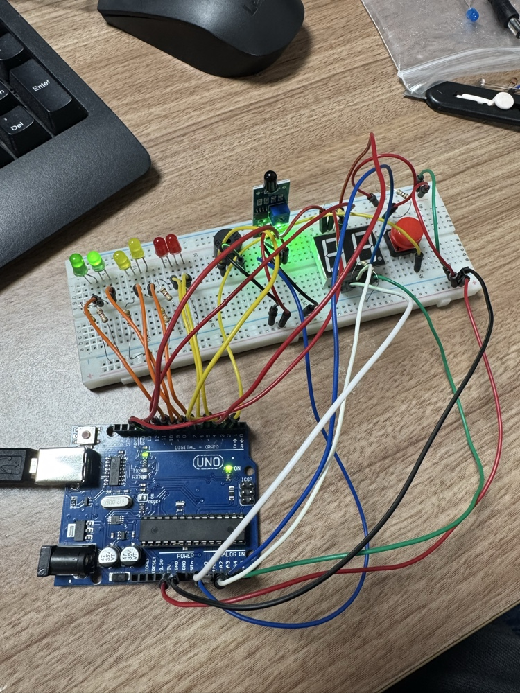
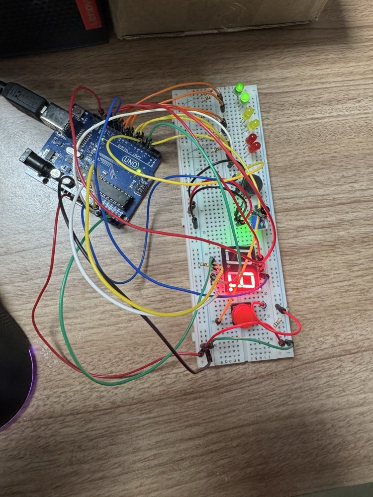
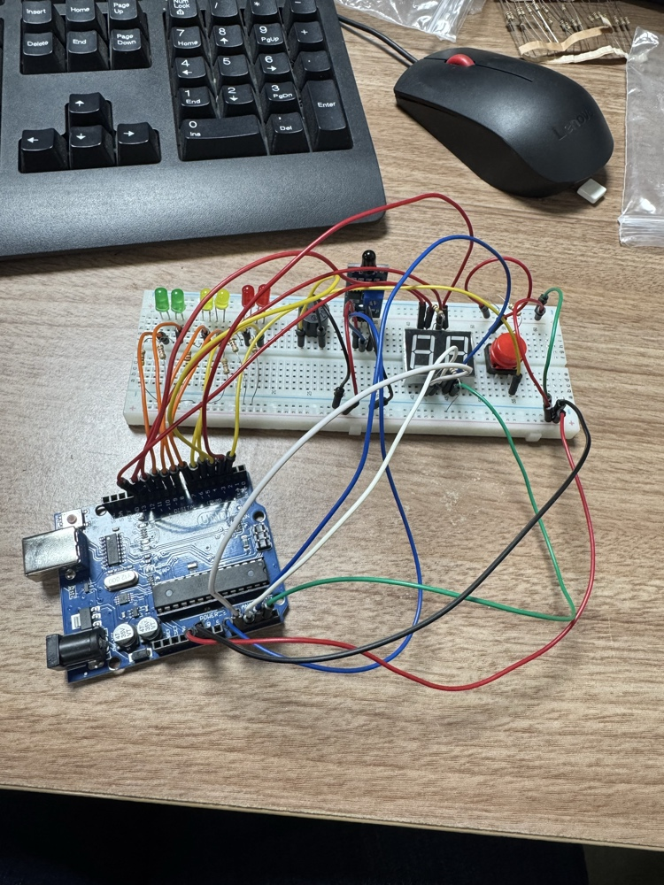
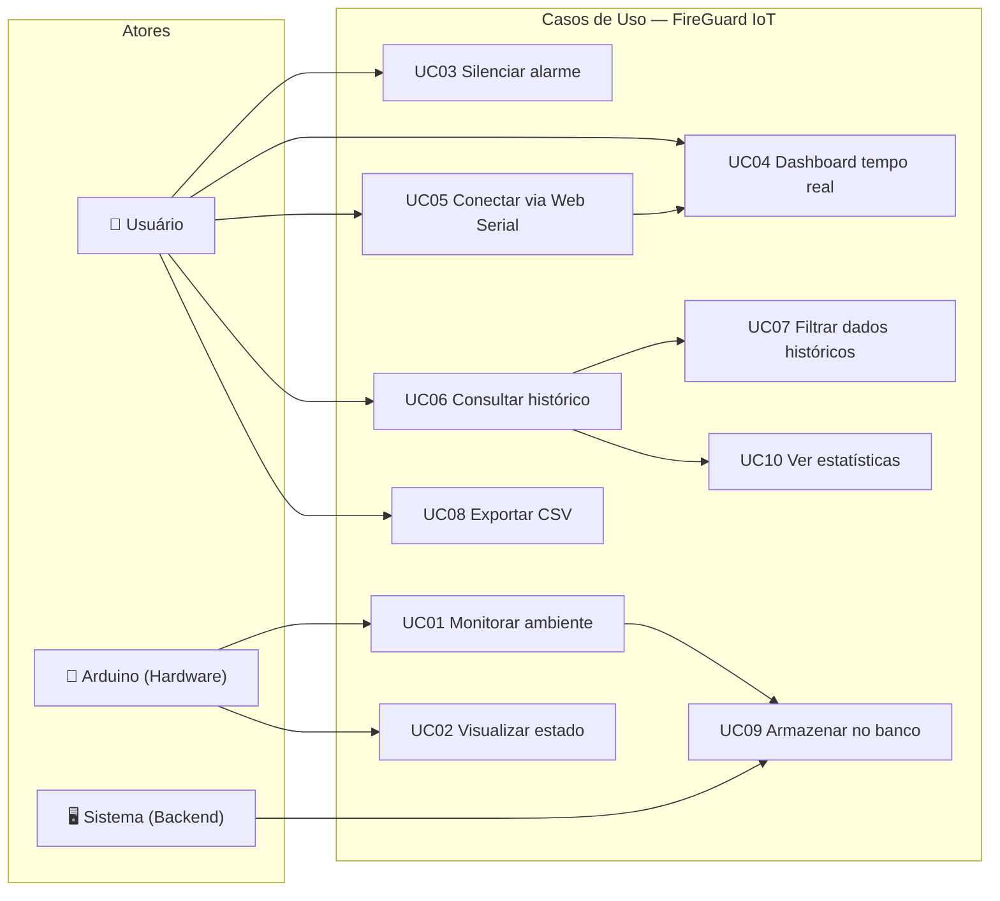
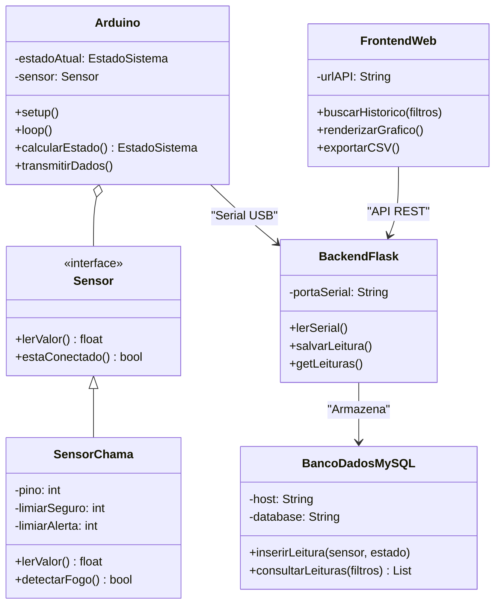
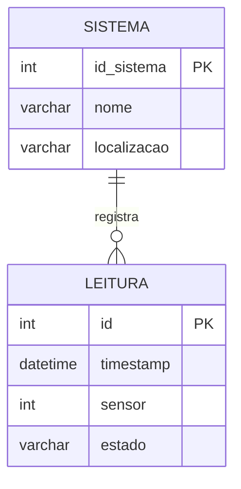

# 🔥 FireGuard IoT — Sistema Inteligente de Alarme de Incêndio

Projeto acadêmico da disciplina de **Internet das Coisas (IoT)** que implementa um sistema completo de alarme de incêndio, integrando hardware (Arduino UNO), backend (Python Flask + MySQL) e frontend web (HTML5 + JavaScript).

O sistema monitora continuamente o ambiente por meio de um **sensor de chama infravermelho**, classifica o nível de risco em estados (SEGURO, ALERTA, PERIGO, SILENCIADO), aciona feedback visual e sonoro local, transmite os dados via serial para um servidor que os armazena em banco de dados **MySQL** e disponibiliza uma interface web para consulta histórica com filtros avançados.

<p align="center">
  
  
  
</p>

---

## Equipe

| Nome |
|------|
| Richardson da Conceição Ferreira |
| Wallace Gustavo da Silva |
| Emanuele De Oliveira Ferreira |
| Vinícius Silva Da Conceição |

**Disciplina:** Internet das Coisas · **Professor:** Altemar Sales · **Universidade de Vassouras**

---

## Sumário

- [Arquitetura do Sistema](#arquitetura-do-sistema)
- [Hardware](#hardware)
- [Como Funciona](#como-funciona)
- [Frontend Web](#frontend-web)
- [Backend e Banco de Dados](#backend-e-banco-de-dados)
- [API REST](#api-rest)
- [Diagramas](#diagramas)
- [Requisitos](#requisitos)
- [Estrutura do Repositório](#estrutura-do-repositório)
- [Como Executar](#como-executar)

---

## Arquitetura do Sistema

O sistema é composto por três camadas integradas:

```
┌─────────────────────────────────────────────────────────────────┐
│  CAMADA 1 — HARDWARE (Arduino UNO)                              │
│  Sensor Chama (A0) → Máquina de Estados → LEDs + Buzzer +       │
│  Display 7-seg → Serial USB (9600 baud)                         │
└────────────────────────┬────────────────────────────────────────┘
                         │ "Sensor: 850 | Estado: SEGURO"
                         ▼
┌─────────────────────────────────────────────────────────────────┐
│  CAMADA 2 — BACKEND (Python Flask)                              │
│  Leitura Serial → Validação → MySQL (tabela leituras)           │
│  API REST: /api/leituras, /api/leituras/resumo, /api/leitura    │
└────────────────────────┬────────────────────────────────────────┘
                         │ JSON via HTTP
                         ▼
┌─────────────────────────────────────────────────────────────────┐
│  CAMADA 3 — FRONTEND (HTML5 + JavaScript)                       │
│  serial.html  → Dashboard tempo real (Web Serial API)           │
│  historico.html → Consulta histórica + filtros + gráficos       │
└─────────────────────────────────────────────────────────────────┘
```

---

## Hardware

### Componentes Utilizados

| Componente | Quantidade | Pino Arduino |
|---|---|---|
| Arduino UNO | 1 | — |
| Sensor de Chama Infravermelho | 1 | A0 |
| Botão (push-button) | 1 | D2 (INPUT_PULLUP) |
| Buzzer | 1 | D4 |
| LED Verde | 2 | D9, D10 |
| LED Amarelo | 2 | D7, D8 |
| LED Vermelho | 2 | D5, D6 |
| Display 7 Segmentos (Cátodo Comum) | 1 | Ver tabela abaixo |
| Resistores 220 Ω | 6 | Em série com cada LED |

### Pinagem do Display de 7 Segmentos

| Segmento | A | B | C | D | E | F | G | DP |
|---|---|---|---|---|---|---|---|---|
| Pino Arduino | 13 | 3 | A4 | A2 | A1 | 12 | 11 | A3 |

---

## Como Funciona

O sensor de chama lê continuamente a intensidade de luz infravermelha. O valor analógico (0–1023) determina o estado do sistema com **histerese de 30 unidades** para evitar oscilação:

| Leitura | Estado | Indicação |
|---|---|---|
| > 700 | **SEGURO** | LEDs verdes acesos |
| 301 – 700 | **ALERTA** | LEDs amarelos acesos |
| ≤ 300 | **PERIGO** | LEDs vermelhos + buzzer 2500 Hz |
| Botão pressionado | **SILENCIADO** | Display conta regressiva 9→0 |

### Máquina de Estados

```
                  leitura > 700+H
            ┌──────────────────────┐
            ▼                      │
       ┌─────────┐          ┌───────────┐
       │ SEGURO  │──────────│  ALERTA   │
       │ (verde) │ ≤ 700-H  │ (amarelo) │
       └─────────┘          └───────────┘
            ▲                    │
            │  > 700+H           │ ≤ 300-H
            │                    ▼
            │              ┌───────────┐
            └──────────────│  PERIGO   │
               > 700+H     │(vermelho) │
                            └───────────┘
                                 │
                           botão pressionado
                                 ▼
                          ┌──────────────┐
                          │ SILENCIADO   │
                          │  (9 → 0 s)   │
                          └──────────────┘
                                 │
                           10 segundos
                                 ▼
                            volta para SEGURO

H = histerese (30 unidades)
```

### Silenciamento

Ao pressionar o botão físico (com debounce de 50 ms):
1. O alarme é silenciado imediatamente
2. O display de 7 segmentos exibe contagem regressiva de 9 até 0
3. A cada segundo, o buzzer emite um bipe rápido (50 ms a 2000 Hz)
4. Após 10 segundos, o monitoramento é retomado automaticamente

### Formato de Saída Serial

```
=== Alarme de Incendio IoT ===
Sensor: Chama Infravermelho (A0)
Limiares configurados:
  Seguro  > 700
  Alerta  > 300 e <= 700
  Perigo <= 300
Sistema pronto - monitorando...

Sensor: 850 | Estado: SEGURO
Sensor: 512 | Estado: ALERTA
Sensor: 180 | Estado: PERIGO
Alarme silenciado - reiniciando em 10s
Monitoramento retomado.
```

---

## Frontend Web

O projeto inclui três páginas web:

| Página | Descrição |
|---|---|
| `index.html` | Dashboard com **simulação** do sensor (slider + modo automático) |
| `serial.html` | Dashboard com **conexão real** ao Arduino via Web Serial API |
| `historico.html` | **Consulta histórica** com filtros, gráfico e exportação CSV |

### Dashboard em Tempo Real (`serial.html`)

**Requisitos:** Chrome 89+ ou Edge 89+ · Arduino conectado via USB

1. Abra `serial.html` no Chrome/Edge
2. Clique em **"Conectar ao Arduino"**
3. Selecione a porta serial na janela do navegador
4. O dashboard exibe os dados reais do sensor em tempo real

**Funcionalidades:**
- Badge de status colorido (SEGURO / ALERTA / PERIGO / SILENCIADO)
- LEDs virtuais que replicam os LEDs físicos do circuito
- Gauge (velocímetro) com leitura do sensor
- Gráfico de histórico com as últimas 200 leituras
- Display de 7 segmentos virtual com contagem regressiva
- Monitor serial com log de eventos

### Tela de Histórico (`historico.html`)

Requer o **backend** em execução (`python server.py`).

**Filtros disponíveis:**
- Atalhos rápidos: Hoje / Ontem / Últimos 7 dias / Este mês / Todos
- Intervalo de datas personalizado (início e fim)
- Filtro por estado: SEGURO, ALERTA, PERIGO, SILENCIADO
- Limite de registros: 50 / 100 / 200 / 500 / 1000

**Recursos:**
- Cards de estatísticas: total, por estado, mínimo, máximo e média do sensor
- Gráfico de linha com coloração por estado
- Tabela paginada com todos os registros
- Exportação dos dados para **CSV**

---

## Backend e Banco de Dados

### Tecnologias

| Componente | Tecnologia |
|---|---|
| Servidor | Python 3 + Flask |
| Banco de Dados | **MySQL** (Relacional) |
| Comunicação Serial | PySerial |
| CORS | Flask-CORS |

### Estrutura do Banco de Dados (MySQL)

**Banco:** `fireguard_db` · **Tabela:** `leituras`

| Campo | Tipo | Descrição |
|---|---|---|
| `id` | `INT AUTO_INCREMENT PK` | Chave primária |
| `timestamp` | `DATETIME` | Data e hora da leitura |
| `sensor` | `INT` | Valor do sensor de chama (0–1023) |
| `estado` | `VARCHAR(20)` | SEGURO / ALERTA / PERIGO / SILENCIADO |

**Índices:** `idx_timestamp` e `idx_estado` para consultas eficientes.

```sql
CREATE TABLE leituras (
    id        INT          NOT NULL AUTO_INCREMENT,
    timestamp DATETIME     NOT NULL DEFAULT CURRENT_TIMESTAMP,
    sensor    INT          NOT NULL,
    estado    VARCHAR(20)  NOT NULL,
    PRIMARY KEY (id),
    INDEX idx_timestamp (timestamp),
    INDEX idx_estado    (estado)
) ENGINE=InnoDB DEFAULT CHARSET=utf8mb4;
```

---

## API REST

Base URL: `http://localhost:5000`

| Método | Endpoint | Descrição |
|---|---|---|
| `GET` | `/api/leituras` | Retorna leituras com filtros opcionais |
| `GET` | `/api/leituras/resumo` | Estatísticas agregadas do banco |
| `GET` | `/api/leituras/datas` | Lista de datas com registros |
| `POST` | `/api/leitura` | Insere uma leitura via JSON |

### Parâmetros de Filtro — `GET /api/leituras`

| Parâmetro | Exemplo | Descrição |
|---|---|---|
| `periodo` | `hoje`, `ontem`, `semana`, `mes` | Atalho de período |
| `data` | `2025-05-19` | Leituras de um dia específico |
| `data_inicio` | `2025-05-01` | Início do intervalo |
| `data_fim` | `2025-05-19` | Fim do intervalo |
| `estado` | `PERIGO` | Filtrar por estado |
| `limite` | `100` | Máximo de registros (padrão: 200) |

**Exemplos:**
```bash
# Leituras de ontem com estado PERIGO
GET /api/leituras?periodo=ontem&estado=PERIGO

# Intervalo de datas
GET /api/leituras?data_inicio=2025-05-01&data_fim=2025-05-19

# Inserir leitura manualmente
POST /api/leitura
Content-Type: application/json
{ "sensor": 180, "estado": "PERIGO" }
```

---

## Diagramas

### Diagrama de Casos de Uso



```mermaid
graph LR
    subgraph Atores
        U["👤 Usuário"]
        A["🤖 Arduino (Hardware)"]
        S["🖥️ Sistema (Backend)"]
    end
    subgraph UC["Casos de Uso — FireGuard IoT"]
        UC1["UC01 Monitorar ambiente"]
        UC2["UC02 Visualizar estado"]
        UC3["UC03 Silenciar alarme"]
        UC4["UC04 Dashboard tempo real"]
        UC5["UC05 Conectar via Web Serial"]
        UC6["UC06 Consultar histórico"]
        UC7["UC07 Filtrar dados históricos"]
        UC8["UC08 Exportar CSV"]
        UC9["UC09 Armazenar no banco"]
        UC10["UC10 Ver estatísticas"]
    end
    A --> UC1
    A --> UC2
    U --> UC3
    U --> UC4
    U --> UC5
    U --> UC6
    U --> UC8
    S --> UC9
    UC1 --> UC9
    UC6 --> UC7
    UC6 --> UC10
    UC5 --> UC4
```

---

### Diagrama de Classes



```mermaid
classDiagram
    class Sensor {
        <<interface>>
        +lerValor() float
        +estaConectado() bool
    }
    class SensorChama {
        -pino: int
        -limiarSeguro: int
        -limiarAlerta: int
        +lerValor() float
        +detectarFogo() bool
    }
    class Arduino {
        -estadoAtual: EstadoSistema
        -sensor: Sensor
        +setup()
        +loop()
        +calcularEstado() EstadoSistema
        +transmitirDados()
    }
    class BackendFlask {
        -portaSerial: String
        +lerSerial()
        +salvarLeitura()
        +getLeituras()
    }
    class BancoDadosMySQL {
        -host: String
        -database: String
        +inserirLeitura(sensor, estado)
        +consultarLeituras(filtros) List
    }
    class FrontendWeb {
        -urlAPI: String
        +buscarHistorico(filtros)
        +renderizarGrafico()
        +exportarCSV()
    }
    Sensor <|-- SensorChama
    Arduino o-- Sensor
    Arduino --> BackendFlask : "Serial USB"
    BackendFlask --> BancoDadosMySQL : "Armazena"
    FrontendWeb --> BackendFlask : "API REST"
```

---

### Modelo Entidade Relacionamento (MER)



```mermaid
erDiagram
    SISTEMA ||--o{ LEITURA : "registra"
    SISTEMA {
        int id_sistema PK
        varchar nome
        varchar localizacao
    }
    LEITURA {
        int id PK
        datetime timestamp
        int sensor
        varchar estado
    }
```

---

## Requisitos

### Requisitos Funcionais

| ID | Requisito | Descrição |
|---|---|---|
| RF-01 | Leitura do Sensor | Leitura contínua do sensor de chama (A0, 0–1023) |
| RF-02 | Classificação de Estado | SEGURO/ALERTA/PERIGO com histerese de 30 unidades |
| RF-03 | Feedback Visual | LEDs Verde, Amarelo e Vermelho por estado |
| RF-04 | Feedback Sonoro | Buzzer a 2500 Hz no estado PERIGO |
| RF-05 | Silenciamento | Botão físico com debounce de 50 ms |
| RF-06 | Contagem Regressiva | Display 7-seg exibe 9→0 durante silenciamento |
| RF-07 | Transmissão Serial | Dados via USB a 9600 baud |
| RF-08 | Armazenamento MySQL | Backend armazena leituras no banco relacional MySQL |
| RF-09 | Dashboard Tempo Real | Interface Web com gauge, LEDs virtuais e gráfico |
| RF-10 | Tela de Histórico | Página dedicada para consulta dos dados históricos |
| RF-11 | Filtros de Consulta | Por período, datas e estado |
| RF-12 | Estatísticas | Total, por estado, mín/máx/média do sensor |
| RF-13 | Exportação CSV | Download dos dados consultados em CSV |

### Requisitos Não Funcionais (principais)

| ID | Requisito | Métrica |
|---|---|---|
| RNF-01 | Frequência de leitura | ≤ 150 ms entre leituras |
| RNF-02 | Tempo de resposta | Transição de estado em ≤ 200 ms |
| RNF-03 | Histerese | 30 unidades nos limiares |
| RNF-04 | Debounce | 50 ms no botão físico |
| RNF-07 | Usabilidade | Interface responsiva (mobile e desktop) |
| RNF-08 | Banco Relacional | MySQL com índices em `timestamp` e `estado` |
| RNF-09 | Qualidade do Código | Modular, comentado, com `millis()` e constantes nomeadas |

---

## Estrutura do Repositório

```
Projeto_IoT/
├── codigo.ino                        # Código-fonte do Arduino
├── platformio.ini                    # Configuração PlatformIO
├── README.md
├── LICENSE
├── backend/
│   ├── server.py                     # Servidor Flask + MySQL + API REST
│   └── requirements.txt              # Dependências Python
├── frontend/
│   ├── index.html                    # Dashboard (simulação)
│   ├── serial.html                   # Dashboard (Web Serial API)
│   ├── historico.html                # Consulta histórica com filtros
│   ├── style.css                     # Estilos compartilhados
│   ├── app.js                        # Lógica de simulação
│   └── serial.js                     # Lógica de conexão serial
└── docs/
    ├── documento_final.md            # Documentação completa do Trabalho 2
    ├── requisitos_completos.md       # RF e RNF formais
    ├── FireGuard_IoT_Trabalho2.pdf   # Documentação em PDF
    ├── FireGuard_IoT_Apresentacao_Final.pptx  # Slides da apresentação
    ├── diagrama_casos_uso.png        # Diagrama de Casos de Uso
    ├── diagrama_classes.png          # Diagrama de Classes
    ├── diagrama_mer.png              # Modelo Entidade Relacionamento
    ├── diagrama_casos_uso.mmd        # Fonte Mermaid — Casos de Uso
    ├── diagrama_classes.mmd          # Fonte Mermaid — Classes
    ├── diagrama_mer.mmd              # Fonte Mermaid — MER
    ├── guia-uso-e-testes.md          # Guia de uso e testes do frontend
    └── imagens/
        ├── montagem-circuito-01.jpg
        ├── montagem-circuito-02.jpg
        └── montagem-circuito-03.jpg
```

---

## Como Executar

### 1. Hardware (Arduino)

**Requisitos:** Arduino IDE 1.8+ ou PlatformIO · Arduino UNO · Cabo USB

```bash
# Via Arduino IDE
# 1. Abra codigo.ino
# 2. Ferramentas > Placa > Arduino UNO
# 3. Ferramentas > Porta > (selecione a porta correta)
# 4. Upload (Ctrl+U)

# Via PlatformIO
pio run --target upload
pio device monitor --baud 9600
```

### 2. Backend (Python + MySQL)

**Requisitos:** Python 3.8+ · MySQL Server instalado

```bash
# Configurar o banco MySQL (apenas na primeira vez)
mysql -u root -p
CREATE USER 'fireguard'@'localhost' IDENTIFIED BY 'fireguard123';
GRANT ALL PRIVILEGES ON fireguard_db.* TO 'fireguard'@'localhost';
FLUSH PRIVILEGES;
EXIT;

# Instalar dependências Python
cd backend
pip install -r requirements.txt

# Iniciar o servidor (cria o banco automaticamente)
python server.py
# Servidor disponível em: http://localhost:5000
```

### 3. Frontend (Navegador)

```bash
# Dashboard em tempo real (requer Arduino conectado)
# Abra no Chrome/Edge:
frontend/serial.html

# Histórico com filtros (requer backend em execução)
# Abra no Chrome/Edge:
frontend/historico.html
# ou acesse: http://localhost:5000
```

### Calibração do Sensor

Os limiares de detecção podem variar conforme a iluminação do ambiente:

1. Abra o Monitor Serial (9600 baud)
2. Observe os valores com o sensor em repouso (sem chama)
3. Aproxime uma chama e observe o valor diminuir
4. Ajuste as constantes no início do `codigo.ino`:

```cpp
const int LIMIAR_SEGURO = 700;  // acima: SEGURO
const int LIMIAR_ALERTA = 300;  // entre ALERTA e SEGURO
const int HISTERESE     = 30;   // margem anti-oscilação
```

---

## Melhorias Implementadas (v2 — Trabalho 2)

Em relação ao código original:

- **Backend completo** com Flask, MySQL e API REST
- **Tela de histórico** com filtros avançados, gráfico e exportação CSV
- **Banco de dados relacional** MySQL com índices para consultas eficientes
- **Modo simulação automático** no backend quando Arduino não conectado
- **Constantes nomeadas** — todos os valores mágicos substituídos por constantes descritivas
- **Máquina de estados** com `enum` e transições explícitas
- **Histerese** de 30 unidades nos limiares para evitar oscilação de LEDs
- **Debounce** de 50 ms no botão físico via software
- **Macro `F()`** — strings em Flash (PROGMEM) para economizar SRAM
- **Código modular** com funções de responsabilidade única

---

## Licença

Este projeto está licenciado sob a [MIT License](LICENSE).

*Projeto desenvolvido para fins acadêmicos — Universidade de Vassouras, 2025.*
