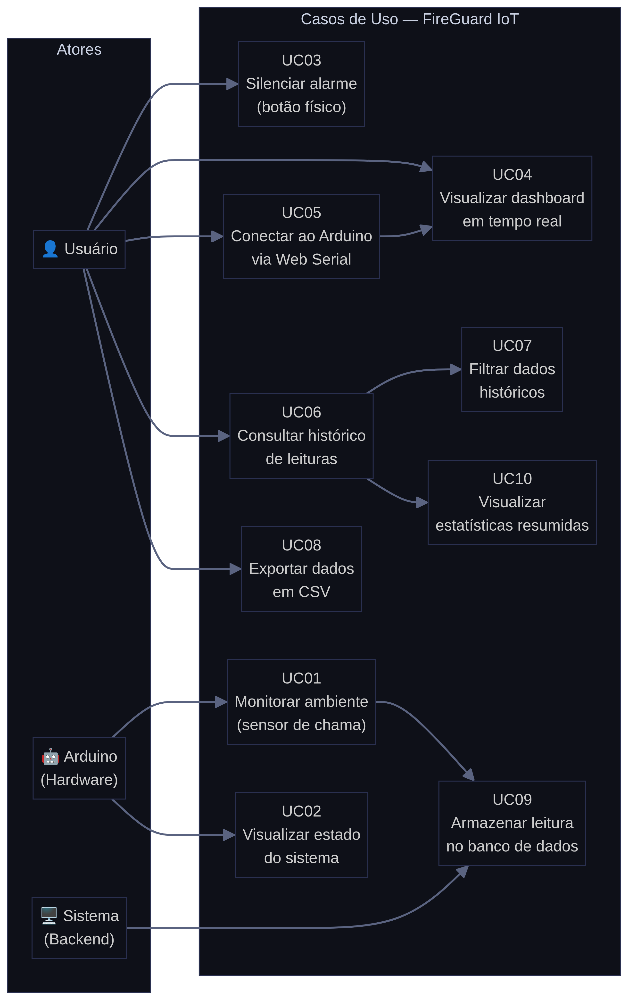
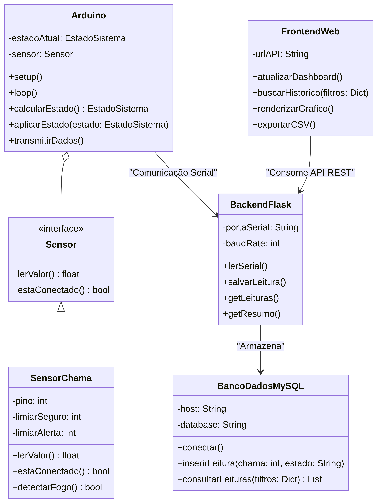
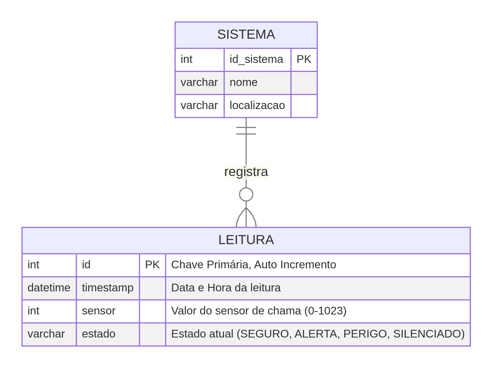

# FireGuard IoT — Documentação do Trabalho 2

**Disciplina:** Internet das Coisas  
**Professor:** Altemar Sales  
**Integrantes:** Richardson, Wallace, Emanuele, Vinícius

---

## 1. Introdução

O **FireGuard IoT** é um sistema de alarme de incêndio inteligente que integra hardware (Arduino UNO) e software (Backend Python + Frontend Web). O sistema monitora continuamente o ambiente por meio de um **sensor de chama infravermelho**, classifica o nível de risco em estados (SEGURO, ALERTA, PERIGO, SILENCIADO), aciona feedback visual e sonoro local, e transmite os dados para um servidor que os armazena em um banco de dados relacional **MySQL** para consulta histórica.

---

## 2. Arquitetura do Sistema

O sistema é composto por três camadas:

**Camada 1 — Hardware (Arduino UNO):** Sensor de chama infravermelho (A0), 6 LEDs (Verde, Amarelo, Vermelho), buzzer, display de 7 segmentos e botão físico.

**Camada 2 — Backend (Python Flask + MySQL):** Servidor que lê os dados da porta serial, valida e armazena no banco de dados MySQL. Expõe uma API REST para o frontend consultar o histórico.

**Camada 3 — Frontend (HTML5 + JavaScript):** Dashboard em tempo real via Web Serial API e tela de histórico com filtros avançados, gráficos e exportação CSV.

---

## 3. Requisitos Funcionais

| ID | Requisito | Descrição |
|---|---|---|
| RF-01 | Leitura do Sensor | Leitura contínua do sensor de chama infravermelho (A0, 0–1023). |
| RF-02 | Classificação de Estado | SEGURO (>700), ALERTA (301–700), PERIGO (≤300) com histerese de 30 unidades. |
| RF-03 | Feedback Visual Local | LEDs Verde (SEGURO), Amarelo (ALERTA), Vermelho (PERIGO). |
| RF-04 | Feedback Sonoro Local | Buzzer contínuo a 2500 Hz no estado PERIGO. |
| RF-05 | Silenciamento Temporário | Botão físico com debounce de 50 ms silencia por 10 segundos. |
| RF-06 | Contagem Regressiva | Display de 7 segmentos exibe contagem de 9 a 0 durante silenciamento. |
| RF-07 | Transmissão Serial | Dados transmitidos via USB a 9600 baud: `Sensor: 850 | Estado: SEGURO`. |
| RF-08 | Armazenamento em BD | Backend armazena leituras no banco de dados relacional **MySQL**. |
| RF-09 | Dashboard em Tempo Real | Interface Web com gauge, LEDs virtuais, display virtual e gráfico. |
| RF-10 | Tela de Histórico | Página dedicada para consulta dos dados históricos do banco MySQL. |
| RF-11 | Filtros de Consulta | Filtros por período (hoje, ontem, 7 dias, mês), datas e estado. |
| RF-12 | Estatísticas Resumidas | Total, por estado, mínimo, máximo e média do sensor. |
| RF-13 | Exportação CSV | Exportação dos dados consultados para arquivo CSV. |

---

## 4. Requisitos Não Funcionais

| ID | Requisito | Categoria | Descrição |
|---|---|---|---|
| RNF-01 | Frequência de Leitura | Desempenho | Sensor lido a cada 150 ms. |
| RNF-02 | Tempo de Resposta | Desempenho | Transição de estado em até 200 ms. |
| RNF-03 | Histerese | Confiabilidade | Margem de 30 unidades nos limiares. |
| RNF-04 | Debounce | Confiabilidade | Botão com debounce de 50 ms. |
| RNF-05 | Alarme | Segurança | Buzzer a 2500 Hz no estado PERIGO. |
| RNF-06 | Recuperação | Segurança | Monitoramento retomado automaticamente após silenciamento. |
| RNF-07 | Usabilidade | Usabilidade | Interface responsiva para mobile e desktop. |
| RNF-08 | Banco Relacional | Portabilidade | Armazenamento em **MySQL** com índices em `timestamp` e `estado`. |
| RNF-09 | Qualidade do Código | Manutenibilidade | Código modular, comentado, com `millis()` e constantes nomeadas. |
| RNF-10 | Comunicação | Confiabilidade | Modo de simulação automático quando Arduino não conectado. |

---

## 5. Diagramas do Sistema

### 5.1 Diagrama de Casos de Uso



### 5.2 Diagrama de Classes



### 5.3 Modelo Entidade Relacionamento (MER)



---

## 6. Estrutura do Banco de Dados (MySQL)

**Banco:** `fireguard_db`  
**Tabela:** `leituras`

| Campo | Tipo | Descrição |
|---|---|---|
| `id` | INT AUTO_INCREMENT PK | Chave primária |
| `timestamp` | DATETIME | Data e hora da leitura |
| `sensor` | INT | Valor do sensor de chama (0–1023) |
| `estado` | VARCHAR(20) | Estado: SEGURO / ALERTA / PERIGO / SILENCIADO |

**Índices:** `idx_timestamp` e `idx_estado` para consultas eficientes.

---

## 7. API REST do Backend

| Método | Endpoint | Descrição |
|---|---|---|
| GET | `/api/leituras` | Retorna leituras com filtros (data, estado, limite) |
| GET | `/api/leituras/resumo` | Estatísticas agregadas do banco |
| GET | `/api/leituras/datas` | Lista de datas com registros |
| POST | `/api/leitura` | Insere uma leitura via JSON |

---

## 8. Código-Fonte Arduino (codigo.ino)

```cpp
// FireGuard IoT — Alarme de Incêndio com Sensor de Chama Infravermelho
// Arduino UNO — Internet das Coisas

const bool ANODO_COMUM = false;
const int LIMIAR_SEGURO = 700;
const int LIMIAR_ALERTA = 300;
const int HISTERESE     = 30;
const unsigned long INTERVALO_LEITURA_MS = 150;
const unsigned long DEBOUNCE_MS          = 50;
const unsigned long CONTAGEM_REGRESSIVA  = 10;
const unsigned int  FREQ_ALARME_HZ       = 2500;

// Pinos do Display 7 segmentos
const int SEG_A=13, SEG_B=3, SEG_C=A4, SEG_D=A2,
          SEG_E=A1, SEG_F=12, SEG_G=11, SEG_DP=A3;
const int PINOS_DISPLAY[] = {SEG_A,SEG_B,SEG_C,SEG_D,SEG_E,SEG_F,SEG_G,SEG_DP};

// Pinos dos sensores e atuadores
const int PINO_SENSOR    = A0;
const int PINO_BOTAO     = 2;
const int PINO_BUZZER    = 4;
const int LED_VERDE_1    = 10, LED_VERDE_2    = 9;
const int LED_AMARELO_1  = 8,  LED_AMARELO_2  = 7;
const int LED_VERMELHO_1 = 6,  LED_VERMELHO_2 = 5;

enum EstadoSistema { SEGURO, ALERTA, PERIGO, SILENCIADO };
EstadoSistema estadoAtual = SEGURO;

// ... (código completo nos arquivos do projeto)

void loop() {
  verificarBotao();
  if (estadoAtual == SILENCIADO) return;
  unsigned long agora = millis();
  if (agora - tempoAnteriorLeitura < INTERVALO_LEITURA_MS) return;
  tempoAnteriorLeitura = agora;
  int nivelChama = analogRead(PINO_SENSOR);
  EstadoSistema novoEstado = calcularEstado(nivelChama);
  if (novoEstado != estadoAtual || primeiraLeitura) {
    estadoAtual = novoEstado;
    aplicarEstado(estadoAtual);
    imprimirEstado(nivelChama);
  }
}

// Formato de saída serial:
// "Sensor: 850 | Estado: SEGURO"
```

---

## 9. Código-Fonte Backend (server.py — trecho principal)

```python
# FireGuard IoT — Backend Flask + MySQL
# Lê dados da serial, armazena no MySQL, expõe API REST

DB_CONFIG = {
    "host":     "localhost",
    "port":     3306,
    "user":     "fireguard",
    "password": "fireguard123",
    "database": "fireguard_db",
}

def init_db():
    """Cria banco e tabela MySQL se não existirem."""
    cursor.execute("""
        CREATE TABLE IF NOT EXISTS leituras (
            id        INT          NOT NULL AUTO_INCREMENT,
            timestamp DATETIME     NOT NULL DEFAULT CURRENT_TIMESTAMP,
            sensor    INT          NOT NULL,
            estado    VARCHAR(20)  NOT NULL,
            PRIMARY KEY (id),
            INDEX idx_timestamp (timestamp),
            INDEX idx_estado    (estado)
        ) ENGINE=InnoDB
    """)

@app.route("/api/leituras", methods=["GET"])
def get_leituras():
    # Filtros: ?data=YYYY-MM-DD, ?estado=PERIGO, ?limite=100
    # ...retorna JSON com os registros filtrados
```

---

## 10. Como Executar o Projeto

**Pré-requisitos:** MySQL instalado, Python 3, Arduino IDE.

```bash
# 1. Configurar o banco MySQL
mysql -u root -p
CREATE USER 'fireguard'@'localhost' IDENTIFIED BY 'fireguard123';
GRANT ALL PRIVILEGES ON fireguard_db.* TO 'fireguard'@'localhost';

# 2. Instalar dependências do backend
cd backend
pip install -r requirements.txt

# 3. Iniciar o servidor
python server.py

# 4. Abrir o frontend
# Abrir serial.html no Chrome/Edge → Conectar ao Arduino
# Abrir historico.html → Consultar histórico com filtros
```

---

## 11. Repositório

**GitHub:** [github.com/richaferreira/Projeto_IoT](https://github.com/richaferreira/Projeto_IoT)
